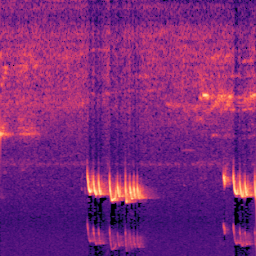

Generating Mel-Spectrograms of the Soundscape Training Data
===========================================================

The cleaning pipeline left us with clean bird audio, but a convolutional image
classifier doesn't train on raw waveforms — it trains on images. This section
converts each cleaned recording into **mel-spectrograms**: 2-D, image-like
representations of sound that we can hand to an off-the-shelf vision model. The
model we target in :doc:`Part 2 <../part2-anvil/index>` is EfficientNet-B0, so
the spectrograms are sized and saved as the fixed-shape inputs it expects.

There are three steps:

#. **Generate** mel-spectrograms from the cleaned audio.
#. **Merge** the spectrogram metadata back with the original BirdCLEF labels.
#. **Reduce** that to a minimal train/validation CSV ready for model training.

The spectrograms and the final metadata CSV are the artifacts you'll stage to
Anvil in :doc:`staging-data`.

Generating Mel-Spectrograms using Librosa
------------------------------------------

A `mel-spectrogram <https://en.wikipedia.org/wiki/Mel_scale>`_ plots frequency
(on the mel scale, which approximates how humans perceive pitch) against time,
with color encoding energy. Representing audio this way turns a
variable-length recording into a fixed-size image, which is exactly what a CNN
image classifier wants.

Working from the ``clean_audio_path`` column produced in the previous section,
the script processes each recording as follows:

#. Load the clean audio at a fixed sample rate and (optionally) RMS-normalize it
   so loudness is consistent across clips.
#. Slice it into fixed-length windows (``--clip_seconds``, stepped by
   ``--hop_seconds``), so one recording yields one or more equally sized chunks.
#. Compute a log-scaled mel-spectrogram per chunk, normalize it to ``[0, 1]``,
   and resize it to a fixed ``--n_mels`` × ``--target_frames`` grid.
#. Save each chunk twice — a ``.npy`` array for training and a colored ``.png``
   (``--png_cmap``) for eyeballing — into a per-label directory.

The command below generates 256 × 256 spectrograms from 5-second clips:

.. code-block:: shell

    python3 generate_spectrograms2.py --from_csv speech_regions_with_nonspeech.csv --output_dir /media/volume/birdclef-working-dir/melspecs --workers 16 --sr 32000 --clip_seconds 5 --hop_seconds 5 --n_mels 256 --target_frames 256 --fmin 50 --fmax 14000 --png_cmap magma

Alongside the spectrograms, the script writes ``mel_metadata.csv`` (one row per
chunk: the source audio, the ``.npy``/``.png`` paths, the inferred label, chunk
index, and shape) and a ``mel_config.json`` recording the exact settings used —
so a run is reproducible and self-documenting.

.. note::
   The script pins BLAS/OpenMP to a single thread per process so that
   parallelism comes only from ``--workers``; otherwise each worker would spawn
   its own math threads and oversubscribe the cores. Use ``--workers`` to match
   your instance's core count.

.. collapse:: Code: Mel Spectrogram Generation Python Script

    .. code-block:: python

        #!/usr/bin/env python3

        # Pin BLAS/OpenMP to one thread PER PROCESS so the process pool is the only
        # source of parallelism (otherwise workers x BLAS-threads oversubscribes cores).
        # Must run before numpy/librosa import. setdefault respects anything you preset.
        import os
        os.environ.setdefault("OMP_NUM_THREADS", "1")
        os.environ.setdefault("OPENBLAS_NUM_THREADS", "1")
        os.environ.setdefault("MKL_NUM_THREADS", "1")
        os.environ.setdefault("NUMEXPR_NUM_THREADS", "1")

        import argparse
        import json
        import multiprocessing as mp
        import sys
        from concurrent.futures import ProcessPoolExecutor, as_completed
        from pathlib import Path

        import librosa
        import numpy as np
        import pandas as pd
        from tqdm import tqdm
        from PIL import Image
        import matplotlib

        matplotlib.use("Agg")  # no GUI backend needed; we only read colormaps

        AUDIO_EXTENSIONS = {".wav", ".flac", ".ogg", ".mp3", ".m4a"}

        def find_audio_files(input_dir: Path):
            audio_files = []
            for path in input_dir.rglob("*"):
                if path.is_file() and path.suffix.lower() in AUDIO_EXTENSIONS:
                    audio_files.append(path)
            return sorted(audio_files)

        def rms_normalize(y: np.ndarray, target_db: float = -20.0, eps: float = 1e-8):
            rms = np.sqrt(np.mean(y ** 2))
            if rms < eps:
                return y

            target_rms = 10 ** (target_db / 20.0)
            y = y * (target_rms / (rms + eps))

            peak = np.max(np.abs(y))
            if peak > 1.0:
                y = y / peak * 0.99

            return y

        def pad_or_crop_audio(y: np.ndarray, target_samples: int):
            if len(y) == target_samples:
                return y

            if len(y) < target_samples:
                pad_total = target_samples - len(y)
                pad_left = pad_total // 2
                pad_right = pad_total - pad_left
                return np.pad(y, (pad_left, pad_right), mode="constant")

            start = (len(y) - target_samples) // 2
            return y[start:start + target_samples]

        def iter_chunks(
            y: np.ndarray,
            sr: int,
            clip_seconds: float,
            hop_seconds: float,
            min_chunk_seconds: float,
        ):
            clip_samples = int(sr * clip_seconds)
            hop_samples = int(sr * hop_seconds)
            min_samples = int(sr * min_chunk_seconds)

            if len(y) < min_samples:
                return

            if len(y) <= clip_samples:
                yield 0, pad_or_crop_audio(y, clip_samples)
                return

            start = 0
            chunk_id = 0

            while start < len(y):
                chunk = y[start:start + clip_samples]

                if len(chunk) < min_samples:
                    break

                chunk = pad_or_crop_audio(chunk, clip_samples)
                yield chunk_id, chunk

                chunk_id += 1
                start += hop_samples

        def resize_time_axis(mel: np.ndarray, target_frames: int):
            if mel.shape[1] == target_frames:
                return mel.astype(np.float32)

            old_x = np.linspace(0.0, 1.0, mel.shape[1])
            new_x = np.linspace(0.0, 1.0, target_frames)

            resized = np.empty((mel.shape[0], target_frames), dtype=np.float32)

            for i in range(mel.shape[0]):
                resized[i, :] = np.interp(new_x, old_x, mel[i, :])

            return resized

        def make_log_mel(
            y: np.ndarray,
            sr: int,
            n_fft: int,
            hop_length: int,
            n_mels: int,
            fmin: int,
            fmax: int,
            top_db: int,
            target_frames: int,
        ):
            mel = librosa.feature.melspectrogram(
                y=y,
                sr=sr,
                n_fft=n_fft,
                hop_length=hop_length,
                n_mels=n_mels,
                fmin=fmin,
                fmax=fmax,
                power=2.0,
            )

            mel_db = librosa.power_to_db(mel, ref=np.max, top_db=top_db)

            mel_min = mel_db.min()
            mel_max = mel_db.max()

            if mel_max - mel_min > 1e-8:
                mel_norm = (mel_db - mel_min) / (mel_max - mel_min)
            else:
                mel_norm = np.zeros_like(mel_db, dtype=np.float32)

            mel_norm = resize_time_axis(mel_norm, target_frames)
            return mel_norm.astype(np.float32)

        def save_colored_mel_png(mel: np.ndarray, out_path: Path, cmap_name: str = "magma"):
            """Save a normalized mel spectrogram (values in [0, 1]) as a colored PNG."""
            cmap = matplotlib.colormaps[cmap_name]
            rgba = cmap(mel)  # H x W x 4
            rgb = (rgba[:, :, :3] * 255).astype(np.uint8)
            img = Image.fromarray(rgb)
            img.save(out_path)

        def infer_label(audio_path: Path, input_dir: Path):
            rel = audio_path.relative_to(input_dir)
            if len(rel.parts) >= 2:
                return rel.parts[0]
            return "unknown"

        def label_from_relpath(relpath: str):
            parts = Path(relpath).parts
            return parts[0] if len(parts) >= 2 else "unknown"

        def items_from_dir(input_dir: Path):
            """Build work items by crawling a directory. Item = {path, label, base}."""
            items = []
            for p in find_audio_files(input_dir):
                items.append({"path": p, "label": infer_label(p, input_dir), "base": p.stem})
            return items

        def items_from_csv(csv_path: Path, audio_col: str, relpath_col: str):
            """Build work items from a separate_speech.py CSV. Rows with an empty
            audio path are skipped. Label/base are taken from the relpath column so
            output naming follows the original clip identity, not the cleaned filename."""
            df = pd.read_csv(csv_path)
            if audio_col not in df.columns:
                sys.exit(f"error: column '{audio_col}' not in {csv_path} (have: {list(df.columns)})")
            has_relpath = relpath_col in df.columns

            items, skipped = [], 0
            for rec in df.to_dict("records"):
                ap = rec.get(audio_col)
                if ap is None or (isinstance(ap, float) and pd.isna(ap)) or str(ap).strip() == "":
                    skipped += 1
                    continue
                ap = str(ap)
                relpath = str(rec[relpath_col]) if (has_relpath and not pd.isna(rec[relpath_col])) else ""
                label = label_from_relpath(relpath) if relpath else "unknown"
                base = Path(relpath).stem if relpath else Path(ap).stem
                items.append({"path": Path(ap), "label": label, "base": base})
            return items, skipped

        def process_file(file_index: int, item: dict, cfg: dict):
            """Process one work item into chunked mels. Returns (index, [row dicts], status)."""
            rows = []
            path = item["path"]
            try:
                label = item["label"]
                base = item["base"]
                label_dir = cfg["output_dir"] / label

                y, _ = librosa.load(path, sr=cfg["sr"], mono=True)
                y = np.nan_to_num(y)

                if cfg["rms_normalize"]:
                    y = rms_normalize(y, target_db=cfg["target_db"])

                made_dir = False
                for chunk_id, chunk in iter_chunks(
                    y=y,
                    sr=cfg["sr"],
                    clip_seconds=cfg["clip_seconds"],
                    hop_seconds=cfg["hop_seconds"],
                    min_chunk_seconds=cfg["min_chunk_seconds"],
                ):
                    chunk_rms = float(np.sqrt(np.mean(chunk ** 2)))
                    if chunk_rms < cfg["min_rms"]:
                        continue

                    mel = make_log_mel(
                        y=chunk,
                        sr=cfg["sr"],
                        n_fft=cfg["n_fft"],
                        hop_length=cfg["hop_length"],
                        n_mels=cfg["n_mels"],
                        fmin=cfg["fmin"],
                        fmax=cfg["fmax"],
                        top_db=cfg["top_db"],
                        target_frames=cfg["target_frames"],
                    )

                    if not made_dir:
                        label_dir.mkdir(parents=True, exist_ok=True)
                        made_dir = True

                    base_name = f"{base}__chunk{chunk_id:04d}"
                    npy_out_path = label_dir / f"{base_name}.npy"
                    png_out_path = label_dir / f"{base_name}.png"

                    np.save(npy_out_path, mel)
                    save_colored_mel_png(mel, png_out_path, cmap_name=cfg["png_cmap"])

                    rows.append({
                        "source_audio": str(path),
                        "mel_npy_path": str(npy_out_path),
                        "mel_png_path": str(png_out_path),
                        "label": label,
                        "chunk_id": chunk_id,
                        "sample_rate": cfg["sr"],
                        "clip_seconds": cfg["clip_seconds"],
                        "rms": chunk_rms,
                        "n_mels": cfg["n_mels"],
                        "target_frames": cfg["target_frames"],
                        "shape": f"{mel.shape[0]}x{mel.shape[1]}",
                    })

                return file_index, rows, "ok"
            except Exception as e:
                return file_index, rows, f"failed: {type(e).__name__}: {e}"

        # --- worker plumbing (used only when --workers > 1) ---
        _CFG: dict = {}

        def _init_worker(cfg):
            _CFG.update(cfg)

        def _pool_worker(payload):
            i, item = payload
            return process_file(i, item, _CFG)

        def process_all(items, cfg, n_workers):
            results = {}
            counts = {"files": 0, "chunks": 0, "failed": 0}
            pbar = tqdm(total=len(items), desc="Generating mel spectrograms", unit="file")

            def tally(i, rows, status):
                results[i] = rows
                if status == "ok":
                    counts["files"] += 1
                    counts["chunks"] += len(rows)
                else:
                    counts["failed"] += 1
                    tqdm.write(f"[WARN] {items[i]['path']}: {status}")
                pbar.update(1)
                pbar.set_postfix(chunks=counts["chunks"], failed=counts["failed"])

            if n_workers == 1:
                for i, item in enumerate(items):
                    tally(*process_file(i, item, cfg))
            else:
                ctx = mp.get_context("spawn")
                with ProcessPoolExecutor(max_workers=n_workers, mp_context=ctx,
                                         initializer=_init_worker, initargs=(cfg,)) as ex:
                    futures = [ex.submit(_pool_worker, (i, item)) for i, item in enumerate(items)]
                    for fut in as_completed(futures):
                        tally(*fut.result())

            pbar.close()

            all_rows = [r for i in range(len(items)) for r in results.get(i, [])]
            return all_rows, counts

        def main():
            parser = argparse.ArgumentParser(
                description="Generate BirdCLEF-style log-mel spectrograms from VAD-cleaned audio."
            )

            src = parser.add_mutually_exclusive_group(required=True)
            src.add_argument("--input_dir", help="Crawl this directory for audio files")
            src.add_argument("--from_csv", help="Read clean audio paths from a separate_speech.py CSV")

            parser.add_argument("--audio_col", default="clean_audio_path",
                                help="CSV column with the audio path (used with --from_csv)")
            parser.add_argument("--relpath_col", default="relpath",
                                help="CSV column giving the original relpath, for label/naming")

            parser.add_argument("--output_dir", required=True)
            parser.add_argument("--metadata_out", default="mel_metadata.csv")

            parser.add_argument("--sr", type=int, default=32000)
            parser.add_argument("--clip_seconds", type=float, default=5.0)
            parser.add_argument("--hop_seconds", type=float, default=5.0)
            parser.add_argument("--min_chunk_seconds", type=float, default=2.0)

            parser.add_argument("--n_fft", type=int, default=2048)
            parser.add_argument("--hop_length", type=int, default=512)
            parser.add_argument("--n_mels", type=int, default=256)
            parser.add_argument("--fmin", type=int, default=50)
            parser.add_argument("--fmax", type=int, default=14000)
            parser.add_argument("--top_db", type=int, default=80)
            parser.add_argument("--target_frames", type=int, default=256)

            parser.add_argument("--min_rms", type=float, default=0.0)
            parser.add_argument("--rms_normalize", action="store_true")
            parser.add_argument("--target_db", type=float, default=-20.0)

            parser.add_argument(
                "--png_cmap",
                type=str,
                default="magma",
                help="Matplotlib colormap for PNG output (e.g. magma, viridis, inferno, plasma).",
            )

            parser.add_argument("--workers", type=int, default=1,
                                help="Worker processes (1 = sequential; <=0 = all cores)")

            args = parser.parse_args()

            output_dir = Path(args.output_dir).resolve()
            output_dir.mkdir(parents=True, exist_ok=True)

            if args.from_csv:
                items, skipped = items_from_csv(Path(args.from_csv), args.audio_col, args.relpath_col)
                print(f"Loaded {len(items)} audio paths from {args.from_csv} "
                      f"({skipped} rows skipped for empty {args.audio_col})")
            else:
                items = items_from_dir(Path(args.input_dir).resolve())
                print(f"Found {len(items)} audio files under {args.input_dir}")

            config = vars(args).copy()
            config["output_dir"] = str(output_dir)
            with open(output_dir / "mel_config.json", "w") as f:
                json.dump(config, f, indent=2)

            if not items:
                print("Nothing to do.")
                return

            n_workers = args.workers if args.workers > 0 else (os.cpu_count() or 1)
            n_workers = min(n_workers, len(items))
            print(f"Processing with {n_workers} worker(s)" + (" (sequential)" if n_workers == 1 else ""))

            cfg = dict(
                output_dir=output_dir,
                sr=args.sr,
                clip_seconds=args.clip_seconds,
                hop_seconds=args.hop_seconds,
                min_chunk_seconds=args.min_chunk_seconds,
                n_fft=args.n_fft,
                hop_length=args.hop_length,
                n_mels=args.n_mels,
                fmin=args.fmin,
                fmax=args.fmax,
                top_db=args.top_db,
                target_frames=args.target_frames,
                min_rms=args.min_rms,
                rms_normalize=args.rms_normalize,
                target_db=args.target_db,
                png_cmap=args.png_cmap,
            )

            all_rows, counts = process_all(items, cfg, n_workers)

            metadata = pd.DataFrame(all_rows)
            metadata_path = output_dir / args.metadata_out
            metadata.to_csv(metadata_path, index=False)

            print(f"Saved {len(metadata)} mel spectrograms "
                  f"from {counts['files']} files ({counts['failed']} failed)")
            print(f"Metadata written to: {metadata_path}")

        if __name__ == "__main__":
            main()
|
Generating Companion Metadata CSV
---------------------------------

``mel_metadata.csv`` describes the spectrograms we generated, but it doesn't
carry the ground-truth labels and taxonomy from the original BirdCLEF release.
The model needs those labels, so the last two steps join the spectrogram
metadata back to the dataset's ``train.csv`` and then distill the result down to
the minimal columns training actually consumes.

Merging the Mel Metadata with the Original Train Metadata
^^^^^^^^^^^^^^^^^^^^^^^^^^^^^^^^^^^^^^^^^^^^^^^^^^^^^^^^^^^

Each spectrogram has to be matched back to the recording it came from. Because
the cleaning stage renamed files (appending suffixes like ``_non_speech``),
the merge keys on the original file *stem* — stripping those suffixes — so a
cleaned chunk like ``1161364/iNat1216197_non_speech.wav`` lines up with the
``1161364/iNat1216197.ogg`` row in ``train.csv``. The result,
``train-mel-metadata.csv``, carries the BirdCLEF labels (e.g.
``primary_label``) attached to every chunk.

.. code-block:: shell

    python3 merge_mel_with_train_metadata.py --input-mel /media/volume/birdclef-working-dir/melspecs/mel_metadata.csv --input-train-metadata /media/volume/birdclef-2026/train.csv --output-csv train-mel-metadata.csv

The script reports how many rows matched and unmatched, and prints a few
example unmatched stems — a quick sanity check that the join keys line up
before you move on.

.. collapse:: Code: Merge Mel Metadata with Train Metadata

    .. code-block:: python

        #!/usr/bin/env python3

        import argparse
        from pathlib import Path

        import pandas as pd

        def get_train_key(filename: str) -> str:
            """
            Convert the original BirdCLEF train metadata filename into a merge key.

            Example:
                1161364/iNat1216197.ogg -> iNat1216197
            """
            return Path(str(filename)).stem

        def get_mel_key(source_audio: str) -> str:
            """
            Convert the VAD-cleaned source audio filename into a merge key.

            Example:
                /path/to/1161364/iNat1216197_non_speech.wav -> iNat1216197
            """
            stem = Path(str(source_audio)).stem

            suffixes_to_strip = [
                "_non_speech",
                "_nonspeech",
                "_speech_removed",
                "_vad_cleaned",
                "_vad",
            ]

            for suffix in suffixes_to_strip:
                if stem.endswith(suffix):
                    stem = stem[: -len(suffix)]
                    break

            return stem

        def main():
            parser = argparse.ArgumentParser(
                description="Merge mel spectrogram metadata with BirdCLEF train metadata using the input file stem."
            )

            parser.add_argument(
                "--input-mel",
                required=True,
                help="Path to mel_metadata.csv.",
            )

            parser.add_argument(
                "--input-train-metadata",
                required=True,
                help="Path to original train.csv metadata.",
            )

            parser.add_argument(
                "--output-csv",
                required=True,
                help="Path to write merged output CSV.",
            )

            args = parser.parse_args()

            mel_csv = Path(args.input_mel)
            train_csv = Path(args.input_train_metadata)
            output_csv = Path(args.output_csv)

            mel_df = pd.read_csv(mel_csv)
            train_df = pd.read_csv(train_csv)

            if "source_audio" not in mel_df.columns:
                raise ValueError(
                    "Expected input mel metadata to contain a 'source_audio' column."
                )

            if "filename" not in train_df.columns:
                raise ValueError(
                    "Expected train metadata to contain a 'filename' column."
                )

            mel_df["input_file_stem"] = mel_df["source_audio"].apply(get_mel_key)
            train_df["input_file_stem"] = train_df["filename"].apply(get_train_key)

            merged_df = mel_df.merge(
                train_df,
                on="input_file_stem",
                how="left",
                suffixes=("_mel", "_train"),
            )

            matched = merged_df["filename"].notna().sum()
            unmatched = merged_df["filename"].isna().sum()

            output_csv.parent.mkdir(parents=True, exist_ok=True)
            merged_df.to_csv(output_csv, index=False)

            print(f"Wrote: {output_csv}")
            print(f"Mel metadata rows: {len(mel_df):,}")
            print(f"Train metadata rows: {len(train_df):,}")
            print(f"Merged rows: {len(merged_df):,}")
            print(f"Matched mel rows: {matched:,}")
            print(f"Unmatched mel rows: {unmatched:,}")

            if unmatched > 0:
                unmatched_examples = (
                    merged_df.loc[merged_df["filename"].isna(), "input_file_stem"]
                    .drop_duplicates()
                    .head(10)
                    .tolist()
                )

                print()
                print("Example unmatched input_file_stem values:")
                for value in unmatched_examples:
                    print(f"  {value}")

        if __name__ == "__main__":
            main()
|
Creating a Minimal CSV for EfficientNet-B0 Training
^^^^^^^^^^^^^^^^^^^^^^^^^^^^^^^^^^^^^^^^^^^^^^^^^^^^

The merged CSV has more columns than training needs. This last step keeps just
the relative spectrogram path and its label, then assigns each row to a train
or validation split. Crucially, the split is **grouped by source recording**
(``input_file_stem``) rather than by chunk: because multiple chunks come from
the same recording, splitting at the chunk level would let near-identical
chunks land in both sets and leak information. Grouping keeps every chunk from a
given recording on the same side of the split.

.. code-block:: shell

    python3 make_effnet_training_csv.py --input-csv train-mel-metadata.csv --output-csv effnet_b0_training_metadata.csv --valid-size 0.66

The output, ``effnet_b0_training_metadata.csv``, is the file the training job in
:doc:`Part 2 <../part2-anvil/index>` reads. Together with the spectrogram images
it's the complete, portable hand-off from preprocessing to training — and the
last thing you'll stage to Anvil.

.. collapse:: Code: Create Minimal CSV for EfficientNet-B0 Training

    .. code-block:: python

        #!/usr/bin/env python3

        import argparse
        from pathlib import Path

        import pandas as pd
        from sklearn.model_selection import GroupShuffleSplit

        def make_relative_mel_path(path_value: str) -> str:
            """
            Convert a full mel PNG path into a tutorial-friendly relative path.

            Example:
                /some/full/path/mel_spectrograms/1161364/iNat842139__chunk0000.png

            becomes:
                1161364/iNat842139__chunk0000.png
            """
            path = Path(str(path_value))

            if len(path.parts) < 2:
                raise ValueError(f"Could not make relative mel path from: {path_value}")

            return str(Path(path.parts[-2]) / path.parts[-1])

        def main():
            parser = argparse.ArgumentParser(
                description="Create a minimal EfficientNet-B0 training metadata CSV."
            )

            parser.add_argument(
                "--input-csv",
                required=True,
                help="Merged metadata CSV containing mel paths and train metadata.",
            )

            parser.add_argument(
                "--output-csv",
                required=True,
                help="Output CSV for EfficientNet-B0 training.",
            )

            parser.add_argument(
                "--valid-size",
                type=float,
                default=0.2,
                help="Fraction of source audio files to place in validation.",
            )

            parser.add_argument(
                "--seed",
                type=int,
                default=42,
                help="Random seed for train/validation split.",
            )

            args = parser.parse_args()

            df = pd.read_csv(args.input_csv)

            required_cols = [
                "mel_png_path",
                "primary_label",
                "input_file_stem",
            ]

            missing = [col for col in required_cols if col not in df.columns]
            if missing:
                raise ValueError(f"Missing required columns: {missing}")

            train_df = pd.DataFrame()

            train_df["mel_path"] = df["mel_png_path"].apply(make_relative_mel_path)
            train_df["primary_label"] = df["primary_label"].astype(str)
            train_df["input_file_stem"] = df["input_file_stem"].astype(str)

            train_df = train_df.dropna(
                subset=[
                    "mel_path",
                    "primary_label",
                    "input_file_stem",
                ]
            )

            splitter = GroupShuffleSplit(
                n_splits=1,
                test_size=args.valid_size,
                random_state=args.seed,
            )

            train_idx, valid_idx = next(
                splitter.split(
                    train_df,
                    groups=train_df["input_file_stem"],
                )
            )

            train_df["split"] = "train"
            train_df.iloc[valid_idx, train_df.columns.get_loc("split")] = "valid"

            output_csv = Path(args.output_csv)
            output_csv.parent.mkdir(parents=True, exist_ok=True)

            train_df.to_csv(output_csv, index=False)

            print(f"Wrote: {output_csv}")
            print(f"Rows: {len(train_df):,}")
            print(f"Classes: {train_df['primary_label'].nunique():,}")
            print()
            print(train_df["split"].value_counts())
            print()
            print("Example rows:")
            print(train_df.head())

        if __name__ == "__main__":
            main()
|
Visualizing and Examining Mel-Spectrograms
------------------------------------------

Before staging everything to Anvil, it's worth opening a few spectrograms to
confirm they look the way you'd expect — a clear band of bird-call energy
against a quiet background, not a wall of noise or an empty frame. Since the
generator saved a colored ``.png`` next to every ``.npy``, you can inspect them
right inside JupyterLab without writing any code.

In JupyterLab, open the file browser's menu and choose
**File → Open from Path...**, then enter the path to a spectrogram, for example:

.. code-block:: text

    /media/volume/birdclef-working-dir/melspecs/trokin/XC400227__chunk0002.png

JupyterLab opens the image in a new tab and you'll see the mel-spectrogram for
that chunk:

    A mel-spectrogram for a single 5-second chunk
    (``trokin/XC400227__chunk0002.png``): time runs left-to-right,
    mel-frequency bottom-to-top, and brighter colors mark louder energy.

Read it like any spectrogram: time runs left-to-right, mel-frequency bottom-to-top,
and brighter colors mark louder energy at that frequency and moment. The bright
arcs and harmonics are the bird vocalization the model will learn to recognize.
Open a handful from different species directories to get a feel for the data —
and to catch any clips that came out empty or noisy before training on them.

.. tip::
   The directory name (``trokin`` above) is the primary class label, and the
   ``__chunkNNNN`` suffix is which 5-second window of the recording it came
   from. Browse other label folders under
   ``/media/volume/birdclef-working-dir/melspecs/`` to compare species.
