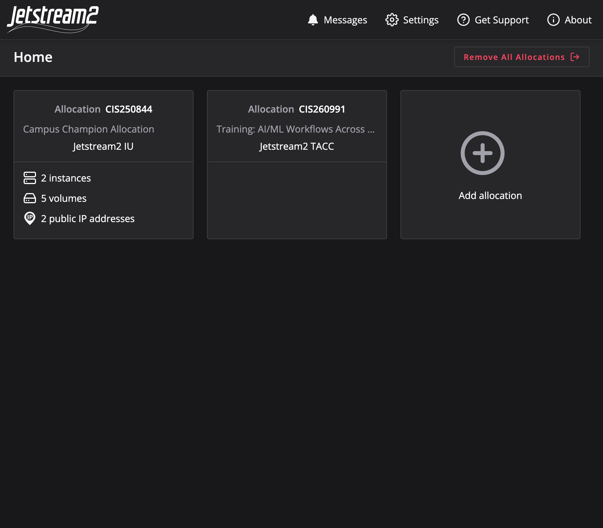
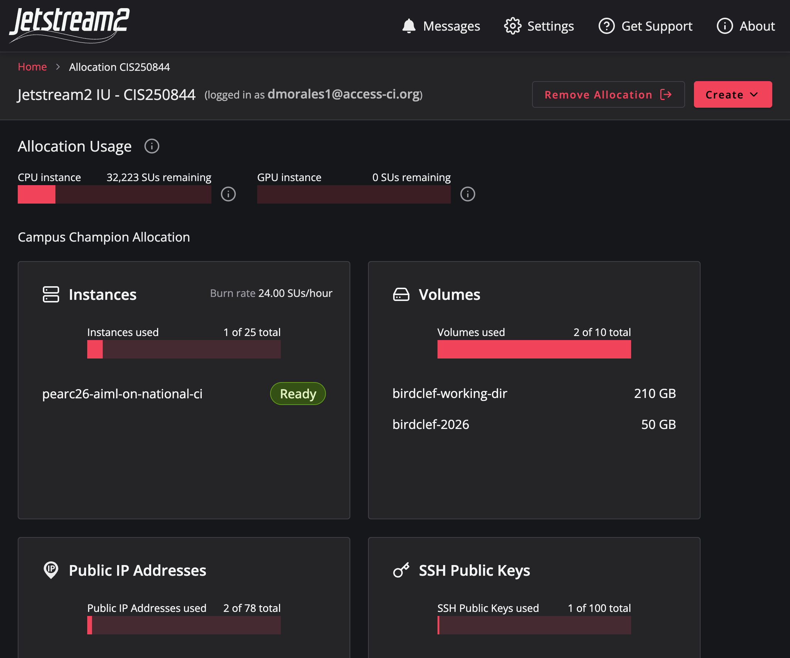
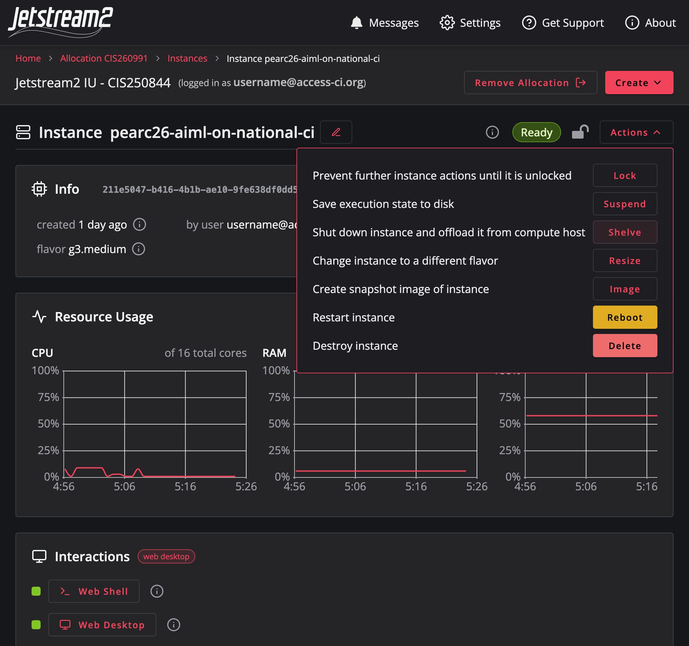

Staging Data for Purdue Anvil
======================

With preprocessing complete, the last step on Jetstream2 is to move the
processed dataset to `Purdue's Anvil <https://docs.rcac.purdue.edu/userguides/anvil/>`_, where you'll train the model in
:doc:`Part 2 <../part2-anvil/index>`. In this section you'll transfer the
mel-spectrograms, verify that they arrived intact, and shelve your Jetstream2
instance so it stops consuming your allocation.

Transfer Options
----------------

There are several ways to move data between ACCESS resources — ``scp``,
``rsync``, `Globus <https://www.globus.org/>`_, or `Pelican <http://pelicanplatform.org/>`_ for Pelican-enabled object storages. For this
tutorial we use ``rsync``: it resumes interrupted transfers, copies only files
that have changed, and preserves permissions, which makes it the most reliable
choice for a large dataset and for any re-runs.

.. code-block::

    # Copy the mel-spectrograms from Jetstream2 to Anvil:
    rsync -avP /media/volume/birdclef-working-dir/mel-spectrograms/ \
        x-user@anvil.rcac.purdue.edu:/anvil/projects/x-cis250844/pearc26-aiml/

This command recursively copies the contents of the local directory containing
the mel-spectrograms to the specified directory on Anvil, preserving file
permissions and showing progress. Adjust the paths and username to match your
own setup.

This transfer will take a while: it moves roughly 500k files totalling about
100 GB, so be patient. Once it completes, verify that the files arrived
correctly before moving on.

.. tip::
    If you are following along as part of the in-person workshop, we have
    already staged the data for you on Anvil. You can skip this section and
    move on to the next one, where we start training the model.

Verifying the Transfer
----------------------

Before tearing down your Jetstream2 instance, confirm that every file arrived
intact. Start by comparing the number of files on each side:

.. code-block::

    # On Jetstream2:
    find /media/volume/birdclef-working-dir/mel-spectrograms/ -type f | wc -l

    # On Anvil:
    find /anvil/projects/x-cis250844/pearc26-aiml/ -type f | wc -l

The two counts should match. For a content-level check, re-run ``rsync`` with
``--checksum`` in dry-run mode (``-n``). It compares checksums rather than
timestamps and file sizes, and reports anything that would still need to be
copied:

.. code-block::

    rsync -avn --checksum /media/volume/birdclef-working-dir/mel-spectrograms/ \
        x-user@anvil.rcac.purdue.edu:/anvil/projects/x-cis250844/pearc26-aiml/

If the file counts match and this dry run reports nothing left to transfer,
your data is on Anvil and intact.

Shelving your Jetstream2 Instance
---------------------------------

It is important to properly shut down your Jetstream2 instance to avoid
unnecessary costs. Once you have verified that your data has been successfully
transferred to Anvil, you can safely shelve your Jetstream2 instance. Make sure
all of your important files and results have been saved and transferred first,
as terminating the instance will result in the loss of any data stored on it.

To shelve your Jetstream2 instance, follow these steps:

1. Log in to your Jetstream2 dashboard and locate the "CIS260991" allocation
   associated with your instance.

2. Locate your active "pearc26-aiml-on-national-ci" instance in the list of
   instances.

3. Click the "Shelve" button to stop the instance and save its state. This
   prevents any further charges while keeping your data intact.

If you need to access the instance again in the future, you can simply "Unshelve" it from the dashboard, and it will resume from where you left off.

.. warning::
    Shelve your instance whenever you are not actively using it, as leaving it
    running can incur unnecessary costs. Always double-check that your data has
    been safely transferred and backed up before shelving or terminating an
    instance.
