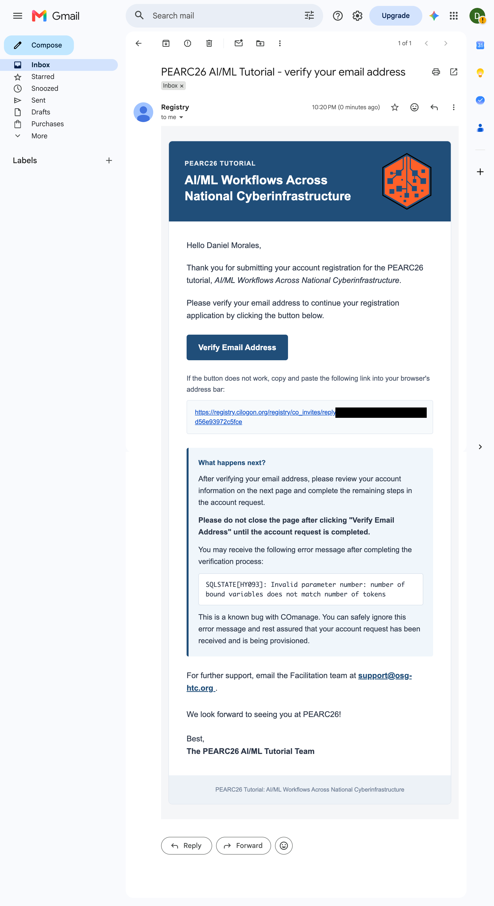
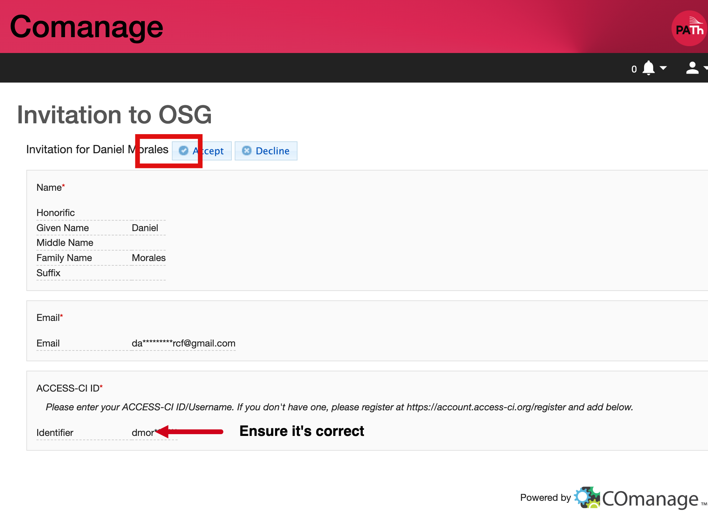
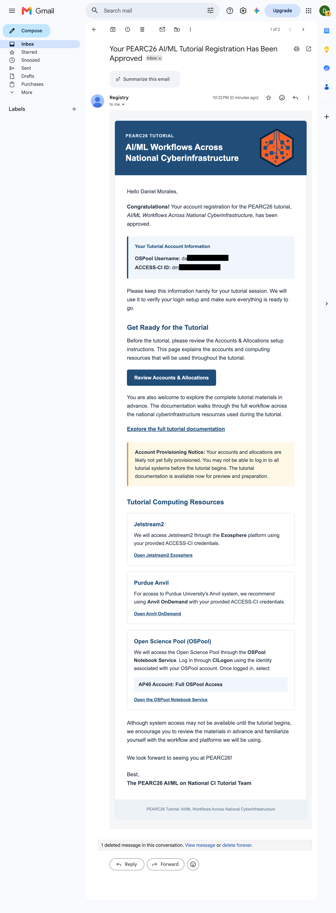

Setup & Prerequisites
=====================

Complete these steps **before** the hands-on portion of the tutorial so you can
follow along live.

.. contents::
   :local:
   :depth: 1

Accounts & Allocations
----------------------

The tutorial spans three national CI systems — Jetstream2, Purdue Anvil, and
the OSPool — but you do **not** need to request your own allocations on any of
them. The organizers have set up a shared tutorial allocation, and completing
the single registration below provisions everything you need:

- An **OSPool account** on the ``ap40`` access point, used for the
  high-throughput inference portion (:doc:`Part 3 <../part3-ospool/index>`).
- Membership in the tutorial's **ACCESS-CI allocation**, which grants access to
  Jetstream2 (:doc:`Part 1 <../part1-jetstream2/index>`) and Anvil
  (:doc:`Part 2 <../part2-anvil/index>`) through your ACCESS-CI ID.

To setup your account, you will need:

#. An **institutional identity** at a US-based institution that is part of the
   InCommon federation (most US universities and labs are). If your institution
   is not in InCommon, you can register with a Google or GitHub account, but
   this requires additional manual verification — contact the tutorial
   organizers for assistance.
#. An **ACCESS-CI ID**. If you don't have one, register at
   https://access-ci.org/register *before* starting the enrollment below —
   the enrollment form asks for it. If you already have one, confirm it is
   active by signing in at https://access-ci.org with your institutional
   identity.

Registering for an Account via the OSPool + ACCESS-CI
-----------------------------------------------------

For the purposes of this tutorial, we will be using the OSPool access point
(``ap40``) and ACCESS-CI. To sign up for an account, you will need to have an
institutional identity that is part of the InCommon federation. If your
institution is not part of the InCommon federation, you can use a Google or
GitHub account to register. **You will need to have a US-based institutional
identity to register for an OSPool account.** If you do not have one, please
contact the tutorial organizers for assistance.

If you already have an OSPool account, please also complete the registration
process to link your OSPool account to your ACCESS-CI ID. This will allow you
to access the tutorial resources and participate in the hands-on exercises.

Starting the registration process
^^^^^^^^^^^^^^^^^^^^^^^^^^^^^^^^^

You can start the application for a new account by following the registration
process below:

#. Visit `the new user enrollment page <https://osg-htc.org/pearc26-ml-enroll>`_.

#. You will be presented with a CILogon Single-Sign On page.
   Select your institution and sign in with your institutional credentials:

   .. image:: https://raw.githubusercontent.com/osg-htc/technology/c141ea015b3a9102dba1a96959fefe3400b008a6/docs/img/comanage/comanage-sso.png
      :alt: CILogon Single-Sign On page

   Please use your institution's credentials as this simplifies the
   verification process; **only select the Google or GitHub identity providers
   if your institution is not an option.**

#. After you have signed in, you will be presented with the self-signup form.
   Click the "BEGIN" button:

   .. image:: ../assets/account-setup/start-enrollment.png
      :alt: COManage self-signup form

   **If you already have an OSPool account, the enrollment form will
   automatically redirect you to a separate page to link your OSPool account to
   your ACCESS-CI ID.** Please follow the instructions on that page to complete
   the linking process. You will most likely need to log in with your CILogon
   identity again to complete the linking process. You will see a new page as
   below:

   .. image:: ../assets/account-setup/duplicate-existing-enrollment.png
      :alt: COManage self-signup form for existing accounts

#. Enter your name and email address.
   In most cases, your institution will provide defaults for your name and
   email address. If you prefer, you may override these values.

   You will need to provide a valid ACCESS-CI ID in the "ACCESS-CI ID" field.
   If you do not have an ACCESS-CI ID, please register for one at
   https://access-ci.org/register. While signing up for an ACCESS-CI ID, you
   will be asked to provide your institutional identity. Please use your
   institutional identity to sign up for an ACCESS-CI ID. **To avoid delays in
   your account becoming active, please ensure you complete the enrollment for
   ACCESS-CI using an institutional ID rather than Google or GitHub, as these
   require further verification.** If you do not have a US-based institutional
   identity, please contact the tutorial organizers for assistance.

   Click the "SUBMIT" button:

   .. image:: ../assets/account-setup/enrollment-fields.png
      :alt: COManage enrollment form

Verifying Your Email Address
----------------------------

After submitting your registration application, you will receive an email from
registry@cilogon.org to verify your email address. The email will look similar
to the following:

Follow the link in the email and click the "Accept" button to complete the
verification:

.. warning::

   You may receive an error message when you finish the verification process
   stating "SQLSTATE[HY093]: Invalid parameter number: number of bound
   variables does not match number of tokens". This is a known bug with
   COmanage, however you can ignore this error message and rest assured that
   your account is being provisioned.

Receiving Your Account Information Email
----------------------------------------

After your account has been provisioned, you will receive an email from
registry@cilogon.org with your account information. The email will look
similar to the following:

Please keep this email for your records, as it contains your OSPool username
and other important information. You will need your OSPool username to log in
to the OSPool access point and participate in the tutorial.

.. note::

   **Account Provisioning Notice:** Your accounts and allocations are likely
   not yet fully provisioned. You may not be able to log in to all tutorial
   systems before the tutorial begins. The tutorial documentation is available
   now for preview and preparation.

.. warning::

   If you do not receive your account information email within 24 hours of
   completing the registration process, please contact the tutorial organizers
   for assistance.

Getting Help
------------

For assistance or questions, please email the support team at
support@osg-htc.org.

Local Tools
-----------

The tutorial is designed to run almost entirely through your **web browser** —
Jetstream2 is managed through the Exosphere web dashboard, Anvil offers Open
OnDemand and Jupyter interfaces, the OSPool offers Jypyter interfaces to the AP
and the guide itself embeds every script you need. We **highly recommend**
using these web interfaces to avoid local installation issues.

- **A modern web browser** (required). We recommend Google Chrome or Firefox
  whenever possible.
- **An SSH client** (optional, but useful). macOS and Linux include ``ssh`` in
  the terminal; on Windows, use the built-in OpenSSH client in PowerShell or
  `PuTTY <https://www.putty.org/>`_. SSH is the primary way to reach the OSPool
  access point (``ssh <username>@ap40.uw.osg-htc.org``) and an alternative way
  to reach Anvil.
- **A code editor with remote support** (optional). If you prefer editing files
  locally, `VS Code <https://code.visualstudio.com/>`_ with the Remote-SSH
  extension works well with all three systems — but the web-based editors and
  notebooks are sufficient for everything in this tutorial.

No local Python installation is needed: all computation happens on the remote
systems.

Getting the Tutorial Materials
------------------------------

There is nothing to download ahead of time:

- **Code** — every script used in the tutorial (preprocessing, training,
  inference, and the job/submit files) is embedded directly in this guide in
  collapsible code blocks, with a copy button in the upper-right corner of each
  block. The relevant page of each part tells you where to place the file on
  that system.
- **Data** — the BirdCLEF audio dataset and intermediate products (cleaned
  audio, spectrograms, trained model checkpoints) are pre-staged on the shared
  tutorial storage of each system, so each part can be started independently.
  The paths are given on the staging page of each part.

Pre-Tutorial Checklist
----------------------

Run through this list before the session; everything above the line should be
done at least **24 hours before the tutorial** so provisioning has time to
complete.

#. ☐ I have an active **ACCESS-CI ID** and can sign in at
   https://access-ci.org with my institutional identity.
#. ☐ I completed the **enrollment form** at the
   `new user enrollment page <https://osg-htc.org/pearc26-ml-enroll>`_
   (or linked my existing OSPool account to my ACCESS-CI ID).
#. ☐ I **verified my email address** via the link from registry@cilogon.org.
#. ☐ I received the **account information email** and saved my OSPool
   username.
#. ☐ I have a **modern web browser** (Chrome or Firefox recommended).
#. ☐ *(Optional)* I have an SSH client and can open a terminal.
#. ☐ I skimmed the :doc:`introduction <../introduction>` for the big picture
   of the three systems.

If any of the account steps fail, email support@osg-htc.org or contact the
tutorial organizers — don't wait until the session starts.
